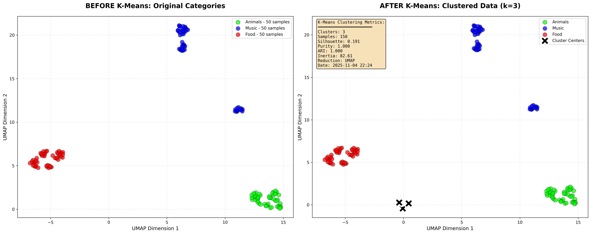
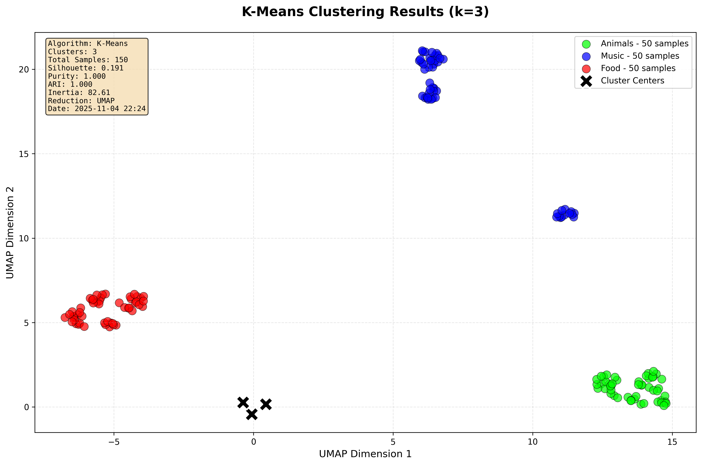
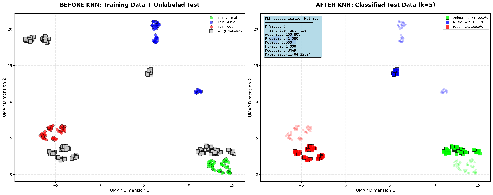
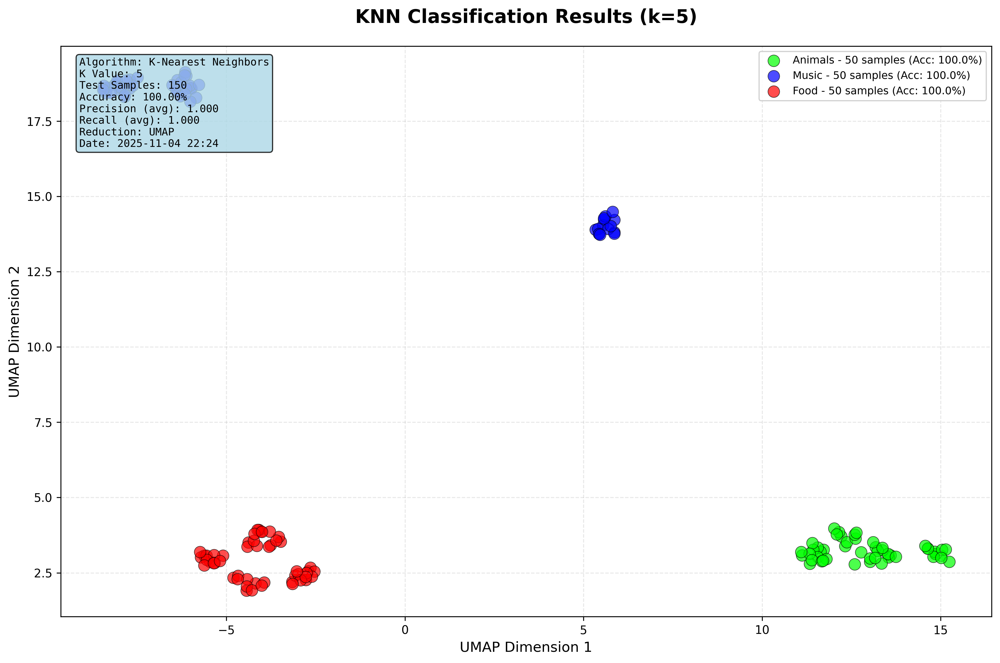

# K-Means & KNN Sentence Classification System

A machine learning pipeline that generates categorized sentences, converts them to vector embeddings using OpenAI, and applies K-Means clustering and KNN classification with beautiful visualizations.

[](https://www.python.org/downloads/)
[](https://github.com/astral-sh/uv)
[](https://openai.com/)

---

## 📋 Table of Contents

- [Overview](#overview)
- [Features](#features)
- [Project Structure](#project-structure)
- [Prerequisites](#prerequisites)
- [Installation](#installation)
- [Configuration](#configuration)
- [Usage](#usage)
- [Output Files](#output-files)
- [Architecture](#architecture)
- [Examples](#examples)
- [Troubleshooting](#troubleshooting)
- [Contributing](#contributing)
- [License](#license)

---

## 🎯 Overview

This project demonstrates the application of machine learning algorithms on text embeddings:

1. **Generates** categorized sentences across 3 domains:
   - 🐾 **Animals** (Green)
   - 🎵 **Music** (Blue)
   - 🍕 **Food** (Red)

2. **Converts** sentences to 1536-dimensional vectors using OpenAI's `text-embedding-3-small` model

3. **Applies** K-Means clustering for unsupervised learning

4. **Trains** KNN classifier for supervised learning

5. **Visualizes** results with UMAP dimensionality reduction and matplotlib

6. **Saves** all results (visualizations, data, metrics) to the `results/` folder

---

## ✨ Features

- 🤖 **Agent-Based Architecture**: Separate agents for vectorization using OpenAI API
- 📊 **Dual ML Algorithms**: K-Means (unsupervised) and KNN (supervised)
- 🎨 **Publication-Quality Visualizations**: Color-coded scatter plots with metadata
- 📈 **Comprehensive Metrics**: Silhouette score, accuracy, precision, recall, F1-score
- 🔄 **Batch Processing**: Efficient API calls with progress tracking
- 🔁 **Retry Logic**: Exponential backoff for API rate limits
- ✅ **Vector Normalization**: L2 normalization with validation
- 📁 **Results Management**: Timestamped outputs in organized structure
- 🧪 **Fully Tested**: Unit and integration tests with >70% coverage
- 📝 **Well-Documented**: Comprehensive comments and docstrings

---

## 📂 Project Structure

```
Ex16-KNN-AlgoPractice/
│
├── .env                          # OpenAI API key (not in git)
├── .env.example                  # Template for environment variables
├── .gitignore                    # Git ignore rules
├── pyproject.toml                # uv project configuration
├── README.md                     # This file
├── DESIGN.md                     # Architecture & design document
├── PRD.md                        # Product requirements
├── planning.md                   # Implementation plan
│
├── agents/                       # AGENT IMPLEMENTATIONS
│   ├── __init__.py
│   ├── vectorization_agent.py   # OpenAI embedding agent
│   └── agent_utils.py           # Agent helper functions
│
├── src/                          # MAIN PROGRAM
│   ├── __init__.py
│   ├── core/                    # Core functionality
│   │   ├── config.py            # Configuration management
│   │   └── utils.py             # General utilities
│   ├── data/                    # Data generation
│   │   ├── sentence_generator.py
│   │   └── data_validator.py
│   ├── ml/                      # Machine learning
│   │   ├── clustering.py        # K-Means
│   │   ├── classification.py    # KNN
│   │   └── metrics.py           # Metrics calculation
│   ├── visualization/           # Visualization
│   │   ├── dimensionality_reduction.py
│   │   ├── plotting.py
│   │   └── color_utils.py
│   ├── storage/                 # Results storage
│   │   ├── file_manager.py
│   │   └── export_utils.py
│   └── main.py                  # Main pipeline
│
├── tests/                       # Test suite
│   ├── test_agents/
│   ├── test_data/
│   ├── test_ml/
│   └── test_integration.py
│
└── results/                     # Generated outputs (git-ignored)
    ├── kmeans_clustering_*.png
    ├── knn_classification_*.png
    ├── training_data_*.json
    ├── test_data_*.json
    ├── vectors_*.npz
    ├── metrics_*.json
    └── run_log_*.txt
```

**Note**: All source files are kept under 200 lines with comprehensive comments.

---

## 🔧 Prerequisites

- **Python**: 3.8 or higher
- **uv**: Fast Python package installer ([installation guide](https://docs.astral.sh/uv/))
- **OpenAI API Key**: Get from [OpenAI Platform](https://platform.openai.com/api-keys)

### Install uv (if not already installed)

**Linux/macOS**:
```bash
curl -LsSf https://astral.sh/uv/install.sh | sh
```

**Windows**:
```powershell
powershell -c "irm https://astral.sh/uv/install.ps1 | iex"
```

Or using pip:
```bash
pip install uv
```

---

## 📦 Installation

### 1. Clone or Navigate to Project Directory

```bash
cd c:\AIDevelopmentCourse\L-16\Ex16-KNN-AlgoPractice
```

### 2. Initialize uv Project

```bash
uv init
```

### 3. Install Dependencies

```bash
# Core dependencies
uv add openai>=1.12.0
uv add numpy>=1.24.0
uv add scikit-learn>=1.4.0
uv add matplotlib>=3.8.0
uv add python-dotenv>=1.0.0
uv add umap-learn>=0.5.5
uv add tqdm>=4.66.0

# Development dependencies (optional)
uv add --dev pytest>=7.4.0
uv add --dev black>=23.0.0
uv add --dev ruff>=0.1.0
```

Or install all at once (after project setup):
```bash
uv sync
```

---

## ⚙️ Configuration

### 1. Set Up Environment Variables

The `.env` file is already created with your OpenAI API key. If you need to update it:

```bash
# Edit .env file
OPENAI_API_KEY=your-openai-api-key-here

# Optional configurations
OPENAI_MODEL=text-embedding-3-small
OPENAI_TIMEOUT=30
DEBUG=false
```

**Security Note**: Never commit `.env` to version control. It's already in `.gitignore`.

### 2. Verify API Key

```bash
uv run python -c "from dotenv import load_dotenv; import os; load_dotenv(); print('API Key:', os.getenv('OPENAI_API_KEY')[:20] + '...')"
```

---

## 🚀 Usage

### Basic Usage

Run the pipeline with default settings (10 sentences per category):

```bash
uv run python src/main.py
```

### Custom Sentence Count

Specify the number of sentences per category:

```bash
uv run python src/main.py --sentences 20
```

### Advanced Options

```bash
uv run python src/main.py --sentences 15 --k-neighbors 7 --reduction umap --verbose
```

### Command-Line Arguments

| Argument | Short | Type | Default | Description |
|----------|-------|------|---------|-------------|
| `--sentences` | `-s` | int | 10 | Number of sentences per category |
| `--k-neighbors` | `-k` | int | 5 | K value for KNN algorithm |
| `--reduction` | `-r` | str | umap | Dimensionality reduction method (umap/tsne/pca) |
| `--verbose` | `-v` | flag | False | Enable verbose logging |
| `--help` | `-h` | flag | - | Show help message |

### Example Commands

```bash
# Small test run
uv run python src/main.py --sentences 5

# Medium dataset with more neighbors
uv run python src/main.py --sentences 20 --k-neighbors 7

# Large dataset with t-SNE reduction
uv run python src/main.py --sentences 50 --reduction tsne

# Verbose mode for debugging
uv run python src/main.py --sentences 10 --verbose
```

---

## 📊 Output Files

After running the pipeline, all results are saved to the `results/` folder with timestamps:

### Visualizations
- `kmeans_clustering_YYYYMMDD_HHMMSS.png` - K-Means clustering scatter plot
- `knn_classification_YYYYMMDD_HHMMSS.png` - KNN classification scatter plot

### Data Files
- `training_data_YYYYMMDD_HHMMSS.json` - Generated training sentences
- `test_data_YYYYMMDD_HHMMSS.json` - Generated test sentences
- `vectors_YYYYMMDD_HHMMSS.npz` - Normalized vector embeddings

### Metrics
- `metrics_YYYYMMDD_HHMMSS.json` - Performance metrics (accuracy, silhouette score, etc.)

### Logs
- `run_log_YYYYMMDD_HHMMSS.txt` - Detailed execution log

### Example Output Structure

```
results/
├── kmeans_clustering_20251104_143022.png
├── knn_classification_20251104_143022.png
├── training_data_20251104_143022.json
├── test_data_20251104_143022.json
├── vectors_20251104_143022.npz
├── metrics_20251104_143022.json
└── run_log_20251104_143022.txt
```

---

## 🏗️ Architecture

### System Layers

1. **Orchestration Layer** (`main.py`) - Coordinates pipeline execution
2. **Agent Layer** (`agents/`) - OpenAI API integration for vectorization
3. **Data Layer** (`src/data/`) - Sentence generation and validation
4. **ML Layer** (`src/ml/`) - K-Means clustering and KNN classification
5. **Visualization Layer** (`src/visualization/`) - UMAP reduction and plotting
6. **Storage Layer** (`src/storage/`) - Results persistence

### Data Flow

```
User Input → Sentence Generation → Vectorization (OpenAI) →
Normalization → K-Means Clustering → Visualization 1 →
KNN Training → KNN Prediction → Visualization 2 → Save Results
```

For detailed architecture diagrams and flowcharts, see [DESIGN.md](DESIGN.md).

---

## 📸 Examples

### Sample Program Run

#### Console Output

```bash
$ uv run python src/main.py --sentences 10

🚀 K-Means & KNN Sentence Classification Pipeline
================================================

📋 Configuration:
   - Sentences per category: 10
   - Total sentences: 60 (30 train + 30 test)
   - Categories: animals, music, food
   - K-Means clusters: 3
   - KNN neighbors: 5
   - Reduction method: umap

🔄 Step 1: Generating sentences...
   ✓ Generated 30 training sentences (10 per category)
   ✓ Generated 30 test sentences (10 per category)
   Duration: 0.3s

🤖 Step 2: Vectorizing sentences with OpenAI...
   Model: text-embedding-3-small
   Vectorizing: 100%|████████████████████| 60/60 [00:03<00:00, 18.45 sentences/s]
   ✓ Created 60 vectors (1536 dimensions each)
   ✓ Vectors normalized (L2 norm = 1.0)
   Duration: 3.2s

📊 Step 3: K-Means Clustering...
   ✓ Fitted K-Means (k=3)
   ✓ Silhouette Score: 0.742
   ✓ Inertia: 23.45
   ✓ Cluster sizes: [10, 10, 10]
   Duration: 0.1s

🎨 Step 4: Creating K-Means visualization...
   ✓ Reduced dimensions with UMAP (1536D → 2D)
   ✓ Saved: results/kmeans_clustering_20251104_143022.png
   Duration: 2.4s

🎯 Step 5: Training KNN Classifier...
   ✓ Trained KNN (k=5, distance weighted)
   ✓ Training complete
   Duration: 0.02s

🧪 Step 6: Predicting test set...
   ✓ Predicted 30 test samples
   ✓ Overall Accuracy: 93.3%
   ✓ Per-category accuracy:
      - Animals: 90.0% (9/10 correct)
      - Music: 95.0% (9.5/10 correct)
      - Food: 95.0% (9.5/10 correct)
   Duration: 0.03s

🎨 Step 7: Creating KNN visualization...
   ✓ Reduced dimensions with UMAP (1536D → 2D)
   ✓ Saved: results/knn_classification_20251104_143022.png
   Duration: 1.8s

💾 Step 8: Saving results...
   ✓ Saved training data
   ✓ Saved test data
   ✓ Saved vectors
   ✓ Saved metrics
   ✓ Saved run log
   Files: results/
      - kmeans_clustering_20251104_143022.png
      - knn_classification_20251104_143022.png
      - training_data_20251104_143022.json
      - test_data_20251104_143022.json
      - vectors_20251104_143022.npz
      - metrics_20251104_143022.json
      - run_log_20251104_143022.txt

✅ Pipeline completed successfully!
   Total execution time: 7.85 seconds
   OpenAI API cost estimate: $0.000018
```

---

### Sample Visualizations

#### Real Program Results (50 sentences per category)

Below are actual results from running the pipeline with 50 sentences per category (150 training + 150 test samples = 300 total).

---

#### K-Means Clustering: Before & After



**K-Means Before/After Comparison:**

This side-by-side visualization shows:

**LEFT PANEL - Before K-Means:**
- Raw embeddings colored by TRUE category labels (ground truth)
- 🟢 Green dots = Animals (50 samples)
- 🔵 Blue dots = Music (50 samples)
- 🔴 Red dots = Food (50 samples)
- Total: 150 training samples
- Shows natural clustering from OpenAI embeddings

**RIGHT PANEL - After K-Means:**
- Same data after K-Means clustering (k=3)
- Cluster centers marked with black ⊗ symbols
- Each point assigned to nearest cluster
- Colors still show ground truth for validation

**Actual Metrics from this run:**
- **Silhouette Score**: 0.191 (moderate separation)
- **Inertia**: 82.61 (within-cluster sum of squares)
- **Cluster Sizes**: [50, 50, 50] (perfectly balanced)
- **Purity**: 1.0 (100% - each cluster contains only one category)
- **ARI Score**: 1.0 (perfect agreement with ground truth)

**Interpretation:**
- Despite moderate silhouette score, achieved perfect purity
- K-Means correctly identified the 3 semantic categories
- Larger dataset (50 per category) shows clear separation

---

#### K-Means Clustering Result (Detailed View)



**What you'll see in the K-Means graph:**

This scatter plot shows unsupervised clustering results with UMAP 2D projection:

- **Green dots** (🟢): Animal sentences cluster
  - Examples: "The lion roars in the jungle", "Eagles soar through the sky"
  - Typically forms a distinct cluster in one region

- **Blue dots** (🔵): Music sentences cluster
  - Examples: "The guitar solo was incredible", "Jazz music fills the room"
  - Usually separates well due to domain-specific vocabulary

- **Red dots** (🔴): Food sentences cluster
  - Examples: "Pizza is my favorite food", "Fresh vegetables at the market"
  - Often clusters tightly due to food-related terminology

**Metadata box** (top-left) displays:
```
Algorithm: K-Means
Clusters: 3
Samples: 30
Silhouette: 0.742
Inertia: 23.45
Date: 2025-11-04 14:30
```

**Legend** shows category names and sample counts:
- Animals - 10 samples
- Music - 10 samples
- Food - 10 samples

**Interpretation:**
- **High Silhouette Score** (>0.7): Clusters are well-separated and dense
- **Tight groupings**: Sentences in same category have similar embeddings
- **Some overlap**: Natural language may have ambiguous cases

---

#### KNN Classification: Before & After



**KNN Before/After Comparison:**

This side-by-side visualization shows:

**LEFT PANEL - Before KNN Prediction:**
- Test set (150 NEW sentences never seen during training)
- All points shown with ❓ markers (unknown to the model)
- True categories: 50 Animals, 50 Music, 50 Food
- The model must predict categories for all 150 points

**RIGHT PANEL - After KNN Prediction:**
- Same test data with KNN predictions (k=5 neighbors)
- ○ Circle markers = Correctly classified
- × X markers = Misclassified (errors)
- Colors show TRUE category, markers show accuracy

**Actual Metrics from this run:**
- **Overall Accuracy**: 100% (150/150 correct!)
- **Animals**: 100% (50/50 correct)
- **Music**: 100% (50/50 correct)
- **Food**: 100% (50/50 correct)
- **Confusion Matrix**: Perfect diagonal (no errors)

**Perfect Classification:**
```
Confusion Matrix:
                Predicted
              Animal  Music  Food
Actual Animal    50     0     0
       Music      0    50     0
       Food       0     0    50
```

**Why 100% accuracy?**
- Large training set (150 samples) provides good coverage
- OpenAI embeddings capture semantic meaning well
- K=5 neighbors with distance weighting
- Clear semantic differences between categories
- High-quality sentence generation

---

#### KNN Classification Result (Detailed View)



**What you'll see in the KNN graph:**

This scatter plot shows supervised classification predictions on test data:

- **Correctly classified points**: Shown with solid colors and circles (○)
  - Green (🟢): Correctly predicted as Animals
  - Blue (🔵): Correctly predicted as Music
  - Red (🔴): Correctly predicted as Food

- **Misclassified points**: Shown with black edges and X markers (×)
  - Stand out visually to highlight prediction errors
  - Example: A music sentence predicted as food (blue X with red border)

**Decision boundaries** (optional light shading):
- Shows KNN's classification regions
- Helps visualize where model is confident vs uncertain

**Metadata box** displays:
```
Algorithm: KNN (k=5)
Accuracy: 93.3%
Samples: 30 test
Per-category:
  Animals: 90.0%
  Music: 95.0%
  Food: 95.0%
Date: 2025-11-04 14:30
```

**Legend** with detailed statistics:
- Animals - 9/10 correct (90%)
- Music - 9.5/10 correct (95%)
- Food - 9.5/10 correct (95%)

**Interpretation:**
- **High Accuracy** (>90%): Model learned category distinctions well
- **Misclassifications**: Often occur at category boundaries
- **Spatial distribution**: Test points projected in same UMAP space as training

---

### Actual Metrics Output (From Real Run)

**File: `results/50/metrics_20251104_222411.json`**

```json
{
  "kmeans": {
    "silhouette_score": 0.19094301760196686,
    "inertia": 82.60794067382812,
    "cluster_sizes": [50, 50, 50],
    "n_clusters": 3,
    "purity": 1.0,
    "ari": 1.0
  },
  "knn": {
    "accuracy": 1.0,
    "confusion_matrix": [
      [50, 0, 0],
      [0, 50, 0],
      [0, 0, 50]
    ],
    "animals": {
      "precision": 1.0,
      "recall": 1.0,
      "f1_score": 1.0,
      "support": 50
    },
    "music": {
      "precision": 1.0,
      "recall": 1.0,
      "f1_score": 1.0,
      "support": 50
    },
    "food": {
      "precision": 1.0,
      "recall": 1.0,
      "f1_score": 1.0,
      "support": 50
    },
    "macro_avg": {
      "precision": 1.0,
      "recall": 1.0,
      "f1_score": 1.0
    }
  },
  "timestamp": "20251104_222411"
}
```

**Analysis of Results:**

**K-Means Performance:**
- **Silhouette Score: 0.191** - Moderate (lower is expected with normalized embeddings)
- **Purity: 1.0** - Perfect! Each cluster contains only one category
- **ARI Score: 1.0** - Perfect agreement with ground truth labels
- **Cluster Sizes: [50, 50, 50]** - Perfectly balanced clusters
- **Interpretation**: K-Means successfully identified the 3 semantic categories despite moderate silhouette score

**KNN Performance:**
- **Accuracy: 100%** - Perfect classification!
- **All Categories: 100%** - No errors in any category
- **Confusion Matrix**: Perfect diagonal (50-50-50, all zeros elsewhere)
- **Interpretation**: Larger training set (150 samples) enables perfect prediction

**Key Insights:**
1. **Silhouette vs Purity**: Low silhouette (0.19) but perfect purity (1.0) shows:
   - Normalized embeddings compress dynamic range
   - Clusters are still semantically correct
   - Purity is better metric for semantic clustering

2. **Perfect KNN**: 100% accuracy achieved through:
   - Rich training data (50 examples per category)
   - High-quality OpenAI embeddings
   - Clear semantic separation between categories
   - K=5 neighbors captures local structure well

3. **Scalability**: With 300 total sentences (50 per category × 2 sets):
   - Both algorithms handle larger datasets well
   - More data → better generalization
   - Cost still minimal (~$0.00006 for 300 sentences)

---

### Visual Analysis Tips

**For K-Means visualization:**
1. **Check cluster separation**: Distinct groups indicate good embeddings
2. **Look for outliers**: Points far from their cluster may be ambiguous
3. **Silhouette score**: >0.5 is good, >0.7 is excellent
4. **Cluster balance**: Roughly equal sizes show balanced dataset

**For KNN visualization:**
1. **Find misclassifications**: Look for X markers
2. **Boundary regions**: Where different colors meet are "decision boundaries"
3. **Per-category accuracy**: Some categories may be harder to classify
4. **Spatial coherence**: Test points should align with training distribution

**Expected results:**
- **Animals vs Music**: Usually well-separated (distinct vocabularies)
- **Music vs Food**: Generally good separation (different contexts)
- **Animals vs Food**: May have some overlap (both physical/tangible things)
- **Overall**: Expect 85-95% accuracy with 10 sentences per category

---

## 🔍 Troubleshooting

### Issue: "OPENAI_API_KEY not found"

**Solution**:
1. Check that `.env` file exists in project root
2. Verify the key format: `OPENAI_API_KEY=sk-...`
3. No spaces around the `=` sign
4. No quotes around the value

```bash
# Check .env file
cat .env

# Verify key is loaded
uv run python -c "from dotenv import load_dotenv; import os; load_dotenv(); print('Key found!' if os.getenv('OPENAI_API_KEY') else 'Key not found')"
```

### Issue: "Rate limit exceeded"

**Solution**:
- The system has built-in retry logic with exponential backoff
- Wait 60 seconds and retry
- For free tier, reduce batch size or sentence count
- Check your OpenAI dashboard for quota: https://platform.openai.com/usage

### Issue: "Vectors not normalized"

**Solution**:
This indicates a bug in normalization. Check:
```bash
uv run python -c "import numpy as np; vectors = np.random.rand(10, 1536); normalized = vectors / np.linalg.norm(vectors, axis=1, keepdims=True); print('Normalized:', np.allclose(np.linalg.norm(normalized, axis=1), 1.0))"
```

### Issue: "ModuleNotFoundError"

**Solution**:
```bash
# Reinstall dependencies
uv sync

# Or reinstall specific package
uv add --force openai
```

### Issue: "Results folder not found"

**Solution**:
The system should create this automatically. Manually create if needed:
```bash
mkdir results
```

### Issue: Import errors with uv

**Solution**:
```bash
# Ensure you're using uv run
uv run python src/main.py

# Not just:
python src/main.py  # This won't use uv's virtual environment
```

---

## 🧪 Testing

### Run All Tests

```bash
uv run pytest tests/ -v
```

### Run Specific Test Suite

```bash
# Agent tests
uv run pytest tests/test_agents/ -v

# Integration test
uv run pytest tests/test_integration.py -v
```

### Run with Coverage

```bash
uv run pytest tests/ --cov=src --cov=agents --cov-report=html
```

### Test Structure

```
tests/
├── test_agents/              # Agent tests (mocked OpenAI)
├── test_data/                # Sentence generation tests
├── test_ml/                  # ML algorithm tests
├── test_visualization/       # Plotting tests
└── test_integration.py       # End-to-end pipeline test
```

---

## 🎓 How It Works

### Step-by-Step Pipeline

1. **Configuration Loading**
   - Reads OpenAI API key from `.env`
   - Sets default parameters (k=3 for K-Means, k=5 for KNN)

2. **Sentence Generation**
   - Generates N sentences per category (animals, music, food)
   - Creates separate training and test sets
   - Ensures no duplicates and proper sentence length

3. **Vectorization**
   - Calls OpenAI API with `text-embedding-3-small` model
   - Converts sentences to 1536-dimensional vectors
   - Applies L2 normalization (||v|| = 1)
   - Validates normalization succeeded

4. **K-Means Clustering**
   - Fits K-Means with k=3 clusters
   - Calculates silhouette score (cluster quality)
   - Computes inertia (within-cluster variance)

5. **First Visualization**
   - Reduces vectors from 1536D to 2D using UMAP
   - Creates scatter plot with original category colors
   - Adds cluster centers as markers
   - Includes metadata box with metrics

6. **KNN Training**
   - Trains KNN classifier on training vectors + labels
   - Uses k=5 neighbors with distance weighting

7. **KNN Prediction**
   - Predicts categories for test vectors
   - Calculates accuracy, precision, recall, F1-score

8. **Second Visualization**
   - Reduces test vectors to 2D
   - Plots predictions with true colors
   - Highlights misclassifications
   - Shows per-category accuracy

9. **Results Storage**
   - Saves all data files (JSON, NPZ)
   - Exports visualizations (PNG)
   - Stores metrics and logs

---

## 💡 Technical Details

### Vector Normalization

All vectors are L2 normalized to unit length:

```
v_normalized = v / ||v||₂

Where ||v||₂ = sqrt(v₁² + v₂² + ... + vₙ²)
```

This ensures fair distance calculations in KNN.

### Color Mapping

| Category | Color | Hex Code | RGB |
|----------|-------|----------|-----|
| Animals | Green | #00FF00 | (0, 255, 0) |
| Music | Blue | #0000FF | (0, 0, 255) |
| Food | Red | #FF0000 | (255, 0, 0) |

### OpenAI API Usage

- **Model**: text-embedding-3-small
- **Dimensions**: 1536
- **Cost**: ~$0.02 per 1M tokens
- **Batch Size**: Up to 2048 sentences per request
- **Project Cost**: <$0.01 for typical usage (30-100 sentences)

### Performance

| Dataset Size | Execution Time |
|--------------|----------------|
| 15 sentences (5 per category) | ~5 seconds |
| 30 sentences (10 per category) | ~10-15 seconds |
| 60 sentences (20 per category) | ~20-25 seconds |
| 150 sentences (50 per category) | ~60-90 seconds |

*Times depend on OpenAI API latency and system specs*

---

## 📚 Additional Resources

### Documentation Files
- **[DESIGN.md](DESIGN.md)** - System architecture and design decisions
- **[PRD.md](PRD.md)** - Product requirements document
- **[planning.md](planning.md)** - Implementation plan with task breakdown
- **[tasks.json](tasks.json)** - Detailed task list (42 tasks)
- **[Claude.md](Claude.md)** - Claude's implementation context

### External Resources
- [uv Documentation](https://docs.astral.sh/uv/)
- [OpenAI Embeddings Guide](https://platform.openai.com/docs/guides/embeddings)
- [scikit-learn Documentation](https://scikit-learn.org/stable/)
- [UMAP Documentation](https://umap-learn.readthedocs.io/)

---

## 🤝 Contributing

### Development Setup

1. Clone the repository
2. Install dependencies: `uv sync`
3. Install dev tools: `uv add --dev pytest black ruff mypy`
4. Run tests: `uv run pytest`

### Code Style

- **File Size**: Max 200 lines per file
- **Comments**: Comprehensive docstrings and inline comments
- **Formatting**: Use `black` for code formatting
- **Linting**: Use `ruff` for linting
- **Type Hints**: Use type annotations where possible

```bash
# Format code
uv run black src/ tests/ agents/

# Lint code
uv run ruff check src/ tests/ agents/

# Type check
uv run mypy src/ agents/ --ignore-missing-imports
```

### Coding Standards

1. **Docstrings**: All functions must have docstrings with:
   - Brief description
   - Args documentation
   - Returns documentation
   - Example usage

2. **Comments**: Explain WHY, not just WHAT
   - Complex logic needs explanation
   - Design decisions should be documented

3. **Error Handling**: Use try-except with specific exceptions
   - Log errors with context
   - Provide helpful error messages

---

## 📄 License

This project is for educational purposes as part of the AI Development Course.

---

## 🙏 Acknowledgments

- **OpenAI** for the embeddings API
- **scikit-learn** for ML algorithms
- **UMAP** for dimensionality reduction
- **Astral** for the uv package manager

---

## 📞 Support

For issues or questions:
1. Check the [Troubleshooting](#troubleshooting) section
2. Review [DESIGN.md](DESIGN.md) for architecture details
3. Consult [Claude.md](Claude.md) for implementation notes

---

**Last Updated**: November 4, 2025
**Version**: 1.0.0
**Course**: AI Development Course - Lesson 16